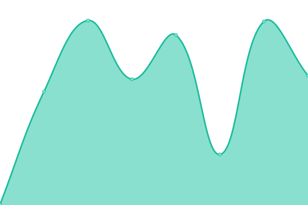

# [📈 Live Status](https://status.dprojects.org): <!--live status--> **🟩 All systems operational**

Este es un monitor de disponibilidad de sitios webs, es open-source con [Upptime](https://upptime.js.org).

Con [Upptime](https://upptime.js.org) puedes tener tu propio monitor de disponibilidad y página de estado ilimitados y gratuitos, todo desde un repositorio de GitHub. Usamos [Issues](https://github.com/upptime/upptime/issues) para reportes de incidentes, [Actions](https://github.com/xDoofy92/status/actions) como monitores de disponibilidad y [Pages](https://status.dprojects.org) para la página de estado.

<!--start: status pages-->
<!-- This summary is generated by Upptime (https://github.com/upptime/upptime) -->
<!-- Do not edit this manually, your changes will be overwritten -->
<!-- prettier-ignore -->
| URL | Status | History | Response Time | Uptime |
| --- | ------ | ------- | ------------- | ------ |
|  [DProjects](https://www.dprojects.org) | 🟩 Up | [d-projects.yml](https://github.com/xdoofy92/status/commits/HEAD/history/d-projects.yml) | 

 428ms
     
 | 

<a href="https://status.xdoofy92.com/history/d-projects">99.48%</a>
    

|  [xdoofy92](https://xdoofy92.com) | 🟩 Up | [xdoofy92.yml](https://github.com/xdoofy92/status/commits/HEAD/history/xdoofy92.yml) | 

 239ms
     
 | 

<a href="https://status.xdoofy92.com/history/xdoofy92">100.00%</a>
    

|  [MiniOS](https://minios.org) | 🟩 Up | [mini-os.yml](https://github.com/xdoofy92/status/commits/HEAD/history/mini-os.yml) | 

 315ms
     
 | 

<a href="https://status.xdoofy92.com/history/mini-os">100.00%</a>
    

<!--end: status pages-->

[**Visita la página de estado →**](https://status.xdoofy92.com)

## 📄 Licencia

- Desarrollado con: [Upptime](https://github.com/upptime/upptime)
- Código: [MIT](./LICENSE) © [Anand Chowdhary](https://anandchowdhary.com), con apoyo de [Pabio](https://pabio.com)
- Datos en el directorio `./history`: [Open Database License](https://opendatacommons.org/licenses/odbl/1-0/)
